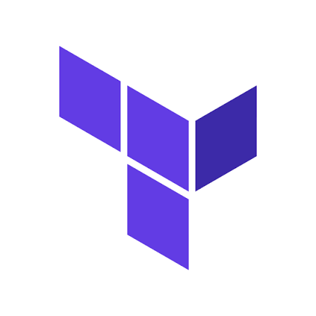
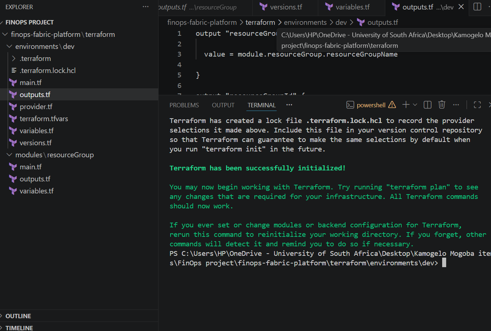
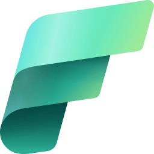

# FinOps Fabric Platform

An Infrastructure-as-Code FinOps platform built with **Azure, Terraform and Microsoft Fabric**. The project is designed to ingest Azure Cost Management data, process it through a Medallion architecture, and expose curated financial information for analysis in Power BI.

The project is intentionally being built as a reusable foundation. The goal is that the infrastructure can be recreated with Terraform instead of manually rebuilding Azure and Fabric resources every time the project is revisited.


```markdown

```

```markdown

```





---

## Table of Contents

1. [Why I Chose This Project](#why-i-chose-this-project)
2. [Project Goals](#project-goals)
3. [Architecture Overview](#architecture-overview)
4. [Azure and Fabric Services](#azure-and-fabric-services)
5. [Infrastructure as Code with Terraform](#infrastructure-as-code-with-terraform)
6. [Data Source](#data-source)
7. [Data Modelling](#data-modelling)
8. [Conceptual Data Model](#conceptual-data-model)
9. [Physical Data Model](#physical-data-model)
10. [Fact Table Grain](#fact-table-grain)
11. [ETL Workflow](#etl-workflow)
12. [Fabric Medallion Architecture](#fabric-medallion-architecture)
13. [OneLake Shortcut](#onelake-shortcut)
14. [Git Version Control and CI/CD](#git-version-control-and-cicd)
15. [Environment Strategy](#environment-strategy)
16. [Repository Structure](#repository-structure)
17. [Prerequisites and Dependencies](#prerequisites-and-dependencies)
18. [Terraform Commands](#terraform-commands)
19. [Useful Azure and Fabric Commands](#useful-azure-and-fabric-commands)
20. [Project Status](#project-status)
21. [Next Steps](#next-steps)

---

# Why I Chose This Project

I wanted to use **Terraform to create a lift-and-shift foundation of services and infrastructure that I could easily redeploy in a few simple steps whenever I return to the project in the coming months.**

I also wanted to explore **FinOps**, a relatively new cloud operating model for me, while going deeper into the capabilities of **Microsoft Fabric**.

The project gives me an opportunity to bring several areas of data engineering together:

- Infrastructure as Code
- Azure cloud services
- Azure Cost Management
- ADLS Gen2
- Microsoft Fabric
- OneLake
- Medallion architecture
- Data modelling
- ETL
- SQL
- Python
- Power BI
- Git
- CI/CD

Rather than building a dashboard from an existing dataset alone, I wanted to build the platform around the data as well.

---

# Project Goals

The platform should eventually be able to:

1. Provision the required Azure infrastructure using Terraform.
2. Configure Microsoft Fabric infrastructure using Terraform.
3. Export Azure Cost Management data to Azure Storage.
4. Expose the exported files to Fabric through an OneLake shortcut.
5. Ingest the data into a Bronze Lakehouse.
6. Clean and standardise the data in a Silver Lakehouse.
7. Build a dimensional Gold model.
8. Load business-ready data into a Fabric Warehouse.
9. Build a Power BI semantic model.
10. Produce FinOps dashboards and insights.
11. Support separate development, testing and production environments.
12. Use Git and CI/CD to control changes between environments.

---

# Daigram Overview

The high-level overview:


## Where to add the architecture image

Add the final architecture diagram here:


Recommended README placement:

```markdown

```

---

# Azure and Fabric Services

The platform currently uses Azure and Microsoft Fabric services as the foundation.

| Service | Purpose |
|---|---|
| Azure Resource Group | Logical container for the Azure infrastructure |
| Azure Storage Account | Provides ADLS Gen2 storage |
| ADLS Gen2 Container | Stores exported Azure Cost Management files |
| Azure Cost Management Export | Produces recurring cost and usage files |
| Microsoft Fabric Workspace | Main Fabric development environment |
| Bronze Lakehouse | Raw landing layer |
| Silver Lakehouse | Cleaned and standardised layer |
| Gold Warehouse | Curated business layer |
| OneLake Shortcut | Provides Fabric access to the Azure storage data without unnecessarily duplicating the source |
| Power BI | Reporting and business intelligence |
| Terraform | Infrastructure as Code |
| GitHub | Source control and collaboration |


# Infrastructure as Code with Terraform

Terraform is one of the main parts of this project.

Instead of manually creating resources through the Azure Portal and Microsoft Fabric interface, Terraform describes the desired infrastructure in code.

The current infrastructure foundation includes:

```text
Terraform
|
+-- Azure Resource Group
|
+-- Storage Account
|
+-- Storage Containers
|      +-- costexports
|      +-- landing
|      +-- terraformstate
|
+-- Azure Cost Management Export
|
+-- Microsoft Fabric Workspace
|
+-- Bronze Lakehouse
|
+-- Silver Lakehouse
|
+-- Gold Warehouse
|
+-- OneLake Shortcut integration
```

## Why Terraform is important

Terraform provides:

- Repeatable deployments
- Infrastructure version control
- Consistent environments
- Easier recovery
- Infrastructure documentation through code
- Reduced manual configuration
- Reusable modules
- Environment separation
- A foundation for CI/CD

The project uses Terraform modules so that individual infrastructure components can be maintained independently.

## Terraform diagram

A simple Terraform diagram can be added here:

```text
                 Terraform
                     |
        +------------+------------+
        |            |            |
      Azure        Fabric       Config
        |            |            |
   Storage       Workspace     Variables
   Cost Export   Lakehouses
                 Warehouse
```

Recommended image location:

```text
docs/images/terraform-architecture.png
```

---

# Data Source

The production source for the platform is intended to be **Azure Cost Management exports**.

Azure Cost Management can export cost and usage information into Azure Storage in formats such as CSV or Parquet.

The project does not currently have a large amount of real billing history because the Azure environment was only recently created. Therefore, a representative Kaggle Azure Cost Analysis dataset is being used as a starter dataset while the real Azure Cost Management export becomes available.

This is useful because the data can be used to validate the data model, ETL process and reporting layer before real billing history is available.

## Example source fields

The starter dataset contains fields such as:

```text
InvoiceSectionName
Date
MeterCategory
CostInBillingCurrency
MeterSubCategory
MeterName
SubscriptionName
ResourceGroup
ConsumedService
ResourceLocation
ResourceName
```

The eventual Azure Cost Management export may contain additional fields such as:

```text
Subscription ID
Subscription Name
Resource Group
Resource Name
Meter Category
Meter Subcategory
Service Name
Region
Usage Quantity
Unit Price
Cost
Currency
Tags
Date
```

The final ingestion layer should therefore be designed to accommodate the actual Azure Cost Management export schema rather than depending permanently on the Kaggle dataset.

---

# Data Modelling

Data modelling is important because the platform is not only storing costs. It needs to answer business questions.

Before creating the Gold layer, the project defines:

- What a cost record represents
- What dimensions describe that cost
- What attributes belong in each dimension
- What measures should be stored
- What the grain of the fact table is
- How the model will be queried by Power BI

The model follows a **star schema** for the analytical layer.

---

# Conceptual Data Model

The conceptual model describes the main business entities without focusing on implementation details.


```

The central business event is **Cost**.

The dimensions provide the context required to understand that cost.

Business questions can then be answered by slicing cost across:

- Date
- Subscription
- Service
- Resource
- Region
- Department
- Cost Center

---

# Physical Data Model

The Gold layer is planned around the following dimensional model:


# Fact_Cost

The central fact table contains the measurable financial events.

Possible measures include:

```text
Cost
UsageQuantity
UnitPrice
```

Additional measures can be added when they are available in the real Cost Management export.

Possible foreign keys:

```text
DateKey
SubscriptionKey
ServiceKey
RegionKey
ResourceKey
DepartmentKey
CostCenterKey
```

Example physical structure:

| Column | Type | Description |
|---|---|---|
| CostKey | BIGINT | Surrogate fact key |
| DateKey | INT | Foreign key to Dim_Date |
| SubscriptionKey | INT | Foreign key to Dim_Subscription |
| ServiceKey | INT | Foreign key to Dim_Service |
| RegionKey | INT | Foreign key to Dim_Region |
| ResourceKey | INT | Foreign key to Dim_Resource |
| DepartmentKey | INT | Foreign key to Dim_Department |
| CostCenterKey | INT | Foreign key to Dim_CostCenter |
| Cost | DECIMAL | Cost amount |
| UsageQuantity | DECIMAL | Resource usage |
| UnitPrice | DECIMAL | Price per unit |
| Currency | STRING | Billing currency |

---

# Dimension Tables

## Dim_Date

Provides the calendar context for cost analysis.

Possible attributes:

```text
DateKey
Date
Day
Month
MonthName
Quarter
Year
Week
IsMonthEnd
```

## Dim_Subscription

Describes the Azure subscription.

Possible attributes:

```text
SubscriptionKey
SubscriptionId
SubscriptionName
```

## Dim_Service

Describes the Azure service.

Possible attributes:

```text
ServiceKey
ServiceName
MeterCategory
MeterSubCategory
MeterName
ConsumedService
```

## Dim_Region

Describes where the resource is deployed.

Possible attributes:

```text
RegionKey
RegionName
```

## Dim_Resource

Describes the Azure resource generating the cost.

Possible attributes:

```text
ResourceKey
ResourceId
ResourceName
ResourceGroup
ResourceType
```

## Dim_Department

Provides the organisational ownership of the resource.

This dimension can eventually be derived from Azure tags or a business mapping table.

Possible attributes:

```text
DepartmentKey
DepartmentName
```

## Dim_CostCenter

Provides financial ownership.

Possible attributes:

```text
CostCenterKey
CostCenterCode
CostCenterName
```

---

# Fact Table Grain

Defining grain before building the fact table is important.

The proposed grain is:

> **One Fact_Cost row represents one cost record for a resource, meter, date and billing context as supplied by the Azure Cost Management export.**

The exact final grain should be confirmed against the actual Azure export schema.

For the starter dataset, a practical initial grain is:

```text
Date
+
Subscription
+
Resource Group
+
Resource
+
Meter
+
Service
+
Region
+
Cost record
```

The grain should not be changed simply to make reporting easier. If aggregation is required, it should normally happen in downstream models or reporting queries.

---

# Data Quality Rules

Before data reaches the Gold layer, the pipeline should validate:

```text
Null checks
Duplicate checks
Schema validation
Data type validation
Negative cost checks
Currency validation
Date validation
Invalid resource checks
Missing subscription checks
Missing service checks
```

Example rules:

| Rule | Expected result |
|---|---|
| Date cannot be null | Pass |
| Cost must be numeric | Pass |
| Subscription should exist | Pass |
| Duplicate business records | None |
| Currency should be valid | Pass |
| Resource information should be valid where supplied | Pass |

---

# ETL Workflow

The ETL process follows the flow:


## ETL responsibilities

### Extract

Retrieve or expose Azure Cost Management files from ADLS Gen2.

### Transform

Perform:

- Schema validation
- Data type conversion
- Deduplication
- Standardisation
- Tag parsing
- Business mappings
- Dimension key generation
- Cost validation

### Load

Load the appropriate datasets into:

```text
Bronze
Silver
Gold
```

---

# ETL Diagram

Recommended visual diagram:


---

# Fabric Medallion Architecture

The project uses the Medallion architecture because the data passes through clear stages of refinement.

## Bronze

The Bronze layer preserves the source data as closely as possible.

Purpose:

- Raw landing area
- Auditability
- Reprocessing
- Source preservation
- Troubleshooting

Example:

```text
bronze_cost_export
```

The Bronze layer should avoid unnecessary business transformations.

---

## Silver

The Silver layer is where the data becomes usable and consistent.

Typical transformations:

```text
Remove duplicates
Convert data types
Standardise names
Validate costs
Parse tags
Standardise regions
Validate subscriptions
Handle null values
```

Example:

```text
silver_cost
```

---

## Gold

The Gold layer is designed for business consumption.

It contains the dimensional model:

```text
Fact_Cost

Dim_Date
Dim_Subscription
Dim_Service
Dim_Region
Dim_Resource
Dim_Department
Dim_CostCenter
```

The Gold layer is designed to make reporting easier, consistent and performant.

---

# Why the Medallion Architecture Matters

Without layers, raw data, transformation logic and business logic can become mixed together.

The Medallion approach creates separation:

```text
Bronze = What did we receive?
Silver = What does the cleaned data look like?
Gold   = What does the business need?
```

This improves:

- Data quality
- Traceability
- Reprocessing
- Debugging
- Governance
- Maintainability
- Reporting performance

Microsoft Fabric is particularly useful here because the platform provides Lakehouses, Warehouses, OneLake and data engineering capabilities within one ecosystem.

---

# OneLake Shortcut

The project uses an **OneLake Shortcut** to connect the Fabric Bronze Lakehouse to the Azure ADLS Gen2 cost export location.

The intention is:

```text
ADLS Gen2
   |
   | costexports
   v
OneLake Shortcut
   |
   v
Bronze Lakehouse
```

The shortcut avoids unnecessarily copying the source files simply to make them visible inside Fabric.

The shortcut is created through the **Fabric REST API** rather than relying entirely on manual configuration.

The Terraform project invokes a PowerShell script through a `null_resource` provisioner.

Conceptually:


The Fabric API requires an ADLS Gen2 connection ID, storage location and subpath.

Example target:

```text
Connection:
Fabric cloud connection

Location:
https://<storage-account>.dfs.core.windows.net

Subpath:
/costexports

Shortcut:
CostExports
```

The shortcut creation logic is designed to be idempotent:

1. List existing shortcuts.
2. Check whether the requested shortcut exists.
3. If it exists, exit successfully.
4. If it does not exist, create it.

This prevents repeated Terraform executions from unnecessarily attempting to recreate the shortcut.

---

# Git Version Control and CI/CD

Git is used to version:

- Terraform
- PowerShell scripts
- SQL
- Notebooks
- Documentation
- Pipeline definitions
- Configuration

The aim is to keep infrastructure and data engineering logic reproducible and reviewable.

## Branch strategy

| Environment | Fabric Workspace Name | GitHub Branch | Purpose |
|---|---|---|---|
| Development | `finops-dev-workspace` | `dev` | Developers sync changes, test new notebooks/pipelines, and commit code. |
| Testing | `finops-test-workspace` | `test` | Automated integration testing. Code arrives through Pull Requests from `dev` to `test`. |
| Production | `finops-prod-workspace` | `main` or `prod` | Stable user-facing environment. Code arrives through Pull Requests from `test` to `main`. |

## CI/CD flow

```text
Developer
   |
   v
dev branch
   |
   | Pull Request
   v
test branch
   |
   | Automated tests
   |
   | Pull Request
   v
main / prod
   |
   v
Production Fabric
```

A CI/CD pipeline should eventually:

1. Validate Terraform formatting.
2. Run Terraform validation.
3. Run Terraform plan.
4. Validate SQL and notebooks where applicable.
5. Run data quality tests.
6. Require approval before production deployment.
7. Apply infrastructure to the appropriate environment.
8. Deploy Fabric artefacts.

## CI/CD diagram

Add a GitHub Actions or CI/CD diagram here:


---

# Environment Strategy

The project is designed around separate environments.

```text
Development
    |
    v
Testing
    |
    v
Production
```

Each environment should have its own:

- Resource group
- Storage resources where appropriate
- Fabric workspace
- Lakehouses
- Warehouse
- Configuration
- Deployment variables

The current project is focused on the Development environment first.

---

# Repository Structure

The repository is organised so that infrastructure, scripts, data engineering logic and documentation are separated.

```text
finops-fabric-platform/
|
+-- Config/
|   +-- fabric.json
|
+-- docs/
|   +-- 01-Business-Requirements.md
|   +-- 02-Solution-Architecture.md
|   +-- 03-Data-Model.md
|   +-- images/
|
+-- scripts/
|   +-- assignFabricCapacity.ps1
|   +-- authenticateFabric.ps1
|   +-- bootstrap.ps1
|   +-- createOneLakeShortcut.ps1
|   +-- createWorkspace.ps1
|   +-- FabricAPi.ps1
|
+-- terraform/
|   |
|   +-- environments/
|   |   +-- dev/
|   |       +-- main.tf
|   |       +-- variables.tf
|   |       +-- outputs.tf
|   |       +-- locals.tf
|   |       +-- provider.tf
|   |       +-- versions.tf
|   |       +-- terraform.tfvars
|   |
|   +-- modules/
|       +-- costManagementExport/
|       +-- fabric/
|       |   +-- lakehouse/
|       |   +-- shortcut/
|       |   +-- warehouse/
|       |   +-- workspace/
|       +-- resourceGroup/
|       +-- storageAccount/
|       +-- storageContainer/
|
+-- notebooks/
|
+-- sql/
|
+-- pipelines/
|
+-- dashboards/
|
+-- README.md
```

The exact directory contents can grow as the ETL and Fabric implementation develops.

---

# Terraform Module Structure

The Terraform configuration uses reusable modules.

```text
terraform/modules/
|
+-- resourceGroup
|
+-- storageAccount
|
+-- storageContainer
|
+-- costManagementExport
|
+-- fabric/
    |
    +-- workspace
    +-- lakehouse
    +-- warehouse
    +-- shortcut
```

The development environment composes these modules.

Example:

```hcl
module "bronzeShortcut" {
  source = "../../modules/fabric/shortcut"

  workspaceId    = module.fabricWorkspace.workspaceId
  lakehouseId    = module.bronzeLakehouse.lakehouseId
  storageAccount = module.storageAccount.storageAccountName
  containerName  = "costexports"
  shortcutName   = "CostExports"

  depends_on = [
    module.bronzeLakehouse
  ]
}
```

---

# Fabric Trial Capacity

The development workspace is intended to use a **Fabric trial capacity**, not Power BI Pro.

The more portable Terraform approach is to look up the capacity by name instead of hard-coding its ID.

Example:

```hcl
data "fabric_capacity" "trial" {
  display_name = var.capacity_name
}

resource "fabric_workspace" "this" {
  display_name = var.workspaceName
  description  = var.workspaceDescription
  capacity_id  = data.fabric_capacity.trial.id
}
```

Then the environment configuration can contain:

```hcl
capacity_name = "Trial-<your-capacity-name>"
```

This makes the Terraform configuration less dependent on a specific capacity GUID.

---

# Prerequisites and Dependencies

The following tools are required for local development.

## Required

- Windows PowerShell
- Azure CLI
- Terraform CLI
- Git
- Microsoft Azure subscription
- Microsoft Fabric access
- Fabric trial or appropriate Fabric capacity
- GitHub account

## Terraform providers

The project currently uses:

```text
hashicorp/azurerm
microsoft/fabric
hashicorp/null
```

The Fabric Terraform provider is used for Microsoft Fabric resources.

The `null` provider is used for the Terraform integration that invokes the OneLake shortcut PowerShell script.

## Azure CLI

Verify installation:

```powershell
az version
```

Authenticate:

```powershell
az login
```

Verify the active account:

```powershell
az account show
```

## Terraform

Verify:

```powershell
terraform version
```

---

# Terraform Commands

Run Terraform from the environment directory:

```powershell
cd terraform/environments/dev
```

## Initialise

```powershell
terraform init
```

This downloads the providers and initialises the Terraform working directory.

## Format

```powershell
terraform fmt -recursive
```

## Validate

```powershell
terraform validate
```

## Plan

```powershell
terraform plan
```

For a saved plan:

```powershell
terraform plan -out=plan.tfplan
```

## Apply

```powershell
terraform apply
```

Or apply the saved plan:

```powershell
terraform apply plan.tfplan
```

## Outputs

```powershell
terraform output
```

## State

```powershell
terraform state list
```

## Destroy

Use carefully:

```powershell
terraform destroy
```

---

## create new workspace 

Use carefully:

```powershell
terraform workspace select -or-create prod
```

---

# Useful Azure Commands

## Login

```powershell
az login
```

## Select subscription

```powershell
az account set --subscription "<subscription-id>"
```

## List resource groups

```powershell
az group list -o table
```

## List storage accounts

```powershell
az storage account list -o table
```

## List storage account keys

Do not commit keys into Git.

```powershell
az storage account keys list `
  --resource-group "<resource-group>" `
  --account-name "<storage-account>"
```

---

# Fabric API Authentication

The shortcut script obtains an access token through Azure CLI:

```powershell
az account get-access-token `
    --resource https://api.fabric.microsoft.com
```

The token is then supplied to the Fabric REST API as:

```text
Authorization: Bearer <token>
```

The project should never commit access tokens, storage account keys or other credentials to GitHub.

Sensitive values should be handled through:

- Azure Key Vault
- GitHub Actions secrets
- Environment variables
- Managed identities
- Service principals
- Secure CI/CD variables

---

# Business Questions

The platform is being designed to answer three main categories of questions.

## Executive

- What did we spend this month?
- Are we within budget?
- Which departments spend the most?
- What is the forecast for month-end?

## Engineering

- Which resources are underutilised?
- Which VMs should be resized?
- Which storage accounts are idle?
- Which resources are missing required tags?

## Finance

- What is the cost by department?
- What is the cost by cost centre?
- What is the budget variance?
- Where are the savings opportunities?

---

# Power BI Reporting

The Gold layer will provide the source for the semantic model.

Planned reports include:

```text
Executive Spending Overview
Budget vs Actual
Cost by Service
Cost by Subscription
Cost by Department
Cost by Cost Centre
Cost by Region
Resource Optimisation
Tag Compliance
Cost Trends
Forecast
```

The semantic model should be built around the Gold star schema rather than directly against raw Bronze data.

---

# Data Quality and Governance

Data quality is part of the ETL process rather than something checked only after the dashboard is built.

The project should eventually include automated checks for:

```text
Schema changes
Null values
Duplicate records
Invalid dates
Invalid costs
Currency inconsistencies
Missing dimensions
Unexpected services
Unexpected regions
Tag compliance
```

The results of these checks should be logged and made visible during pipeline execution.

---

# Cost Forecasting

The starter Kaggle dataset contains historical Azure cost information and can be used to experiment with forecasting.

The main forecasting measure is:

```text
CostInBillingCurrency
```

The initial analysis can examine:

- Daily cost
- Weekly cost
- Monthly cost
- Service trends
- Subscription trends
- Resource trends
- Seasonal patterns
- Month-end forecasts

Forecasting should be treated as an analytical layer built on top of validated historical data.

---

# Project Status

## Completed / Foundation

- Azure resource group provisioned through Terraform
- Azure storage account provisioned
- Storage containers provisioned
- Azure Cost Management export infrastructure configured
- Microsoft Fabric workspace provisioned
- Fabric Bronze Lakehouse provisioned
- Fabric Silver Lakehouse provisioned
- Fabric Gold Warehouse provisioned
- Terraform modules created
- Fabric Terraform provider configured
- OneLake shortcut integration developed through the Fabric REST API
- ADLS Gen2 Fabric cloud connection created for the shortcut
- Initial data model designed
- Conceptual and physical models defined
- Starter Kaggle cost dataset identified

## In Progress

- Finalising OneLake shortcut automation
- Loading starter cost data
- Bronze ingestion
- Silver transformations
- Gold dimensional model
- Data quality framework
- Fabric pipelines/notebooks
- Power BI semantic model
- FinOps dashboards
- CI/CD automation

---

# Next Steps

The next stages of the project are:

```text
1. Finalise OneLake Shortcut
          |
          v
2. Place starter cost file in ADLS Gen2
          |
          v
3. Validate Bronze access
          |
          v
4. Build Bronze ingestion
          |
          v
5. Build Silver transformations
          |
          v
6. Build Dimensions
          |
          v
7. Build Fact_Cost
          |
          v
8. Load Gold Warehouse
          |
          v
9. Create Semantic Model
          |
          v
10. Build Power BI Dashboard
          |
          v
11. Add Data Quality Tests
          |
          v
12. Add CI/CD
```


# Documentation and Diagrams

Recommended documentation structure:

```text
docs/
|
+-- 01-Business-Requirements.md
+-- 02-Solution-Architecture.md
+-- 03-Data-Model.md
+-- images/
    +-- finops-architecture.png
    +-- terraform-architecture.png
    +-- conceptual-model.png
    +-- physical-model.png
    +-- etl-workflow.png
    +-- medallion-architecture.png
    +-- cicd.png
```

The README provides the high-level story of the project, while the `docs/` directory can contain the detailed technical documentation.

---

# Conclusion

The main idea behind this project is to treat FinOps as a complete data engineering problem.

The goal is not simply to display Azure costs in a dashboard.

The platform starts with infrastructure:

```text
Terraform
```

then moves into data:

```text
Azure Cost Management
        |
        v
ADLS Gen2
        |
        v
OneLake
        |
        v
Fabric Medallion Architecture
```

and finally turns that data into business information:

```text
Bronze
  |
Silver
  |
Gold
  |
Semantic Model
  |
Power BI
  |
FinOps Decisions
```

This creates a reusable foundation where infrastructure, data engineering, analytics and reporting are developed as one end-to-end platform.


# Screenshots of the work


